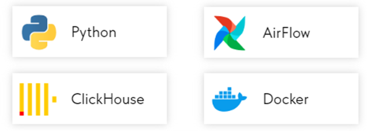
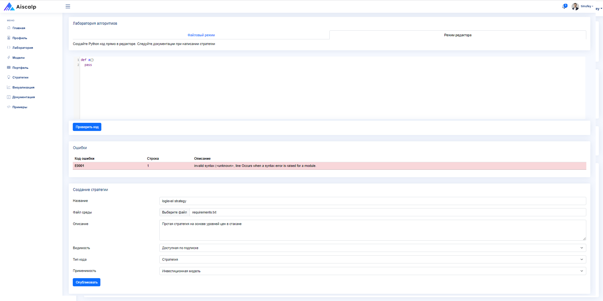

# Aiscalp goalgo
Структура проекта
1) algopack-experements - разработка, стратегий и бэктесты
2) web-app-angular - фронтенд приложения для инвесторов
3) web-app-backend - бэкенд Fast-Api (JWT Auth) приложени для инвесторов
4) web-chart-project - наглядная визуализация данных AlgoPack 
5) web-model-project - проект нашей придиктивной модели на основе ML

Приложение <a href="https://www.aiscalp.store/"> demo </a>
 
https://www.aiscalp.store/

Запуск проекта требует подключение к вашей mongodb
## algopack-experements
</a>
</a>
</a>
</a>

## web-chart-project
</a>

## web-model-project
</a>

## Приложение
### Архитектура решения
</a>
### Стэк Frontend и песочница
</a>
### Стэк Backend и аналитика
</a>

### Главная
</a>
### Стратегии
</a>
### Встроенная визуализация
</a>
### Встроенные примеры
</a>
### Профиль добавление брокера
</a>
### Песочница
</a>
### Pylint валидатор
</a>
### Документация
</a>