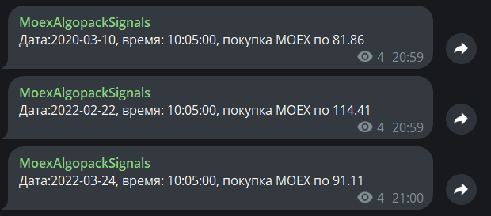

#### Общее
Демо приложения по торговой стратегии на основе данных algopack от мосбиржи.
Приложение написано на Rust. Используется csv файлы с данными с 2020 года по 2023 год по тикеру MOEX. Есть короткая версия файла (первые несколько десятков строк).
Бот написан на языке Rust. Для запуска должен быть установлен сборщик `cargo`. 

Ссылка на пример работы бота в телеграмм канале (сообщения отправляет бот):
https://t.me/moex_algopack_signals

Пример сигналов:  


#### Инструкция по запуску
```
# Переменные окружения Windows PowerShell
# Уровни логирования
$ $Env:RUST_LOG = "error,moex_trading=trace"

# Телеграмм токен от @BotFather
$ $Env:TELOXIDE_TOKEN = "123123:blablabla"

# ID чата/канала в телеграмме, куда бот будет отправлять сигналы. Бот должен иметь разрешение на отправку сообщений.
$ $Env:CHANEL_ID = "-1234567890"


#Unix-like  
$ export RUST_LOG=error,moex_trading=trace  
$ export TELOXIDE_TOKEN=123123:blablabla 
$ export CHANEL_ID=-1234567890


#После прописывания всех переменных можно запускать приложение
$ cargo run 
```


